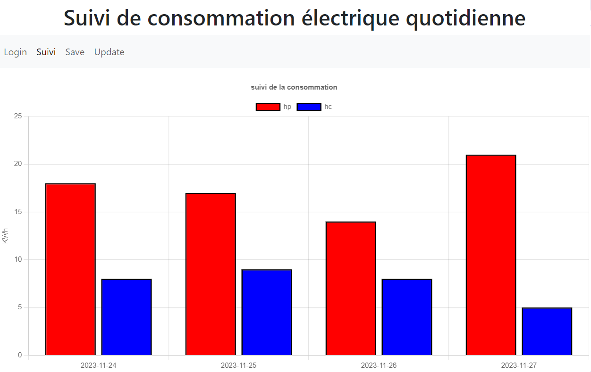
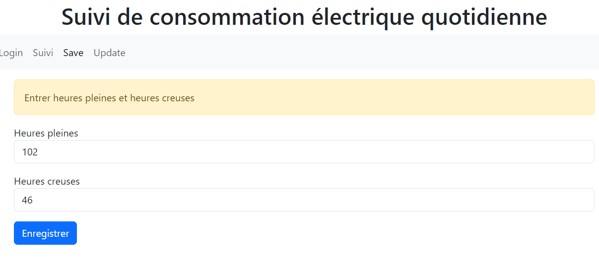

# Api Spring pour suivi de consommation électrique personnelle - backend

Suite à l'installation d'un nouveau compteur électrique, les suivis de consommation heures pleines et heures creuses ne seront pas disponibles pendant au moins un mois.
Une application - en phase de développement - est développée en provisoire pour permettre un suivi graphique.  

L'application comprend : 
- une Api avec Spring Boot, Spring security  
- une sécurisation basée sur token jwt  
- une documentation javadoc  
- des tests avec JUnit  
- une implémentation manuelle (sans JPA) d'une base de données sqlite  
- un serveur NodeJs pour React avec Bootstrap et ChartJs en front-end dans un repo privé.  

# Développement :  

TODO : automatiser la création de la base de données sqlite et son approvisionnement.   
TODO : voir pour une implémentation JPA pour sqlite.  
TODO : créer des tests pour spring Security.  

Dans l'immédiat, création et approvisionnement se font dans le main ElecApplication. 

# Production :  

TODO : dockeriser l'application et la déployer sur VPS linux.
